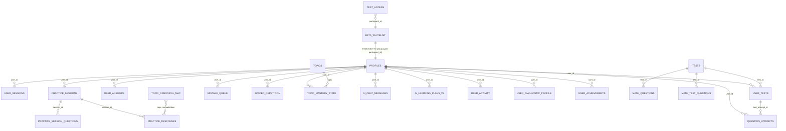

# BilimHub — ER Diagram (Research-relevant)

## Легенда исследовательских ролей

- 🔴 Critical: `profiles`, `beta_whitelist`, `user_tests`, `question_attempts`, `practice_sessions`, `practice_responses`, `topic_mastery_state`, `mistake_queue`, `spaced_repetition`, `ai_chat_messages`, `user_sessions`.
- 🟠 Supporting: `tests`, `topics`, `topic_canonical_map`, `math_questions`, `math_test_questions`, `practice_questions`, `learning_sessions`, `ai_learning_plans_v2`, `user_diagnostic_profile`, `user_activity`.
- ⚪ Not used / system: `invite_codes`, `beta_access`, `rate_limits`, `*_backup`, `pq_explanation_staging`.
